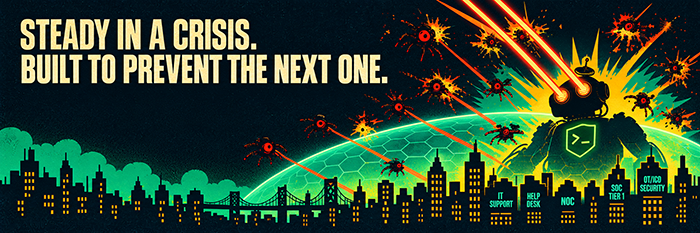

# Hi, I'm Corey

**Steady in a crisis. Built to prevent the next one.**

---

## `>_ whoami`

For 18 years I designed, documented, and remotely troubleshot Crestron/AMX control-system interfaces for commercial, residential, and government clients, cutting support tickets by 28% and deployment time by 50%.

I'm now moving into IT and cybersecurity, and I'm upfront about being entry-level. The long-term goal is **OT/ICS penetration testing**: hacking the systems that run factories, utilities, and robots so the people who depend on them stay safe. I tinker with hardware, pick locks, and like finding out how things break, ethically and on purpose.

## `>_ currently`

- 📚 **CompTIA A+** (coursework complete, exam scheduled), **Network+** (in progress), and **Security+** (upcoming), all targeted for 2026, through Northern Pennsylvania Regional College
- 🧪 **TryHackMe** rooms covering networking, Linux, and introductory security
- 🏠 A **home lab** for hands-on practice with Wireshark, Nmap, and Active Directory
- 🐍 **Python** and **Linux** self-study for automation and security work
- 🔧 A **hardware bench** with soldering gear, a logic analyzer, and test robots for practicing hardware skills

## `>_ where I'm headed`

| Stage | Focus |
|---|---|
| **Now** | IT support, help desk, desktop support, NOC |
| **Next** | SOC / security analyst work, ideally near industrial environments |
| **Then** | OT/ICS security (PLC, SCADA, Modbus, the Purdue model, IEC 62443) |
| **Goal** | OT/ICS and hardware penetration testing, including robots |

## `>_ toolbox`

**Learning and practicing:** Wireshark · Nmap · Active Directory · Linux · Python · TryHackMe

**From my AV career:** Crestron VisionTools · VTPro · ThemeCreator · AMX · technical documentation · SOPs

**Hardware:** soldering · logic analyzer · test robots

## `>_ connect`

- 💼 LinkedIn: [www.linkedin.com/in/coreygeiser]
- 🌐 Portfolio: [coreygeiser.com](https://coreygeiser.com)
- 📧 Email: coreygeiser.contact@gmail.com

If you're hiring, or you just like talking tech, infosec, and robots, say hello.
