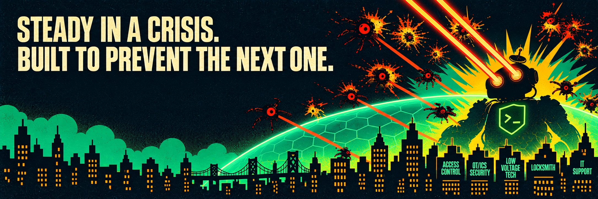

# Hi, I'm Corey

**Steady in a crisis. Built to prevent the next one.**

---

## `>_ whoami`

For 18 years I designed, documented, and remotely troubleshot Crestron/AMX control-system interfaces for commercial, residential, and government clients, cutting support tickets by 28% and deployment time by 50%.

I'm now moving into the hardware side of security, starting with **access control and security systems**, and I'm upfront about being entry-level. The long-term goal is **OT/ICS security and penetration testing**: finding the weak points in the systems that run buildings, factories, utilities, and robots so the people who depend on them stay safe. I tinker with hardware, pick locks as a hobby, and like finding out how things break, ethically and on purpose.

## `>_ currently`

- 📚 **CompTIA A+** (coursework complete, exam scheduled), **Network+** (exam end of October), and **Security+** (November) through Northern Pennsylvania Regional College, plus **CCNA** by independent study (December)
- 🧪 **TryHackMe** rooms covering networking, Linux, and introductory security
- 🏠 A **home lab** for hands-on practice with Wireshark, Nmap, and Active Directory
- 🐍 **Python**, **Linux**, and **PowerShell** self-study for automation and security work
- 🔧 A **hardware bench** with soldering gear, a logic analyzer, and hobby robots
- 🔓 **Locksport** (TOOOL member), because locks are small, well-made security systems
- ➡️ **Next:** free manufacturer training in door hardware and access control basics

## `>_ where I'm headed`

| Stage | Focus |
|---|---|
| **Now** | Access control and security systems technician, low-voltage technician, IT support |
| **Next** | An OT-adjacent bridge role such as building automation (BAS), controls, or NOC work |
| **Then** | OT/ICS security (PLCs, SCADA, Modbus, BACnet, the Purdue model, IEC 62443) |
| **Goal** | OT/ICS and hardware penetration testing, including robots |

## `>_ toolbox`

**Learning and practicing:** Wireshark · Nmap · Active Directory · Linux · Python · PowerShell · TryHackMe · Cisco Packet Tracer · Hyper-V

**From my control-systems career:** Crestron (VTPro, ThemeCreator) · AMX (VisionTools) · HMI and operator interface design · technical documentation · SOPs

**Hardware:** soldering · logic analyzer · hardware diagnostics · hobby robotics

## `>_ pinned projects`

*Planned. Each one will be a repo with a real write-up.*

- **`home-lab-notes`**: network diagrams, VM and firewall setup, and documentation for my practice environment
- **`thm-writeups`**: TryHackMe room write-ups covering the challenge, tools used, approach, and findings
- **`ot-ics-lab`**: a first lab with OpenPLC and Modbus traffic, captured and analyzed in Wireshark
- **`hardware-bench`**: write-ups of hardware projects, from reading UART on a spare device to servo and microcontroller builds
- **`scripts`**: small Python scripts from self-study (log parsers and automation helpers)

## `>_ connect`

- 💼 LinkedIn: [linkedin.com/in/coreygeiser](https://www.linkedin.com/in/coreygeiser)
- 🌐 Portfolio: [coreygeiser.com](https://coreygeiser.com)
- 📧 Email: coreygeiser.contact@gmail.com

If you're hiring, or you just like talking tech, infosec, and robots, say hello.
**Hardware:** soldering · logic analyzer · test robots

## `>_ connect`

- 💼 LinkedIn: www.linkedin.com/in/coreygeiser
- 🌐 Portfolio: [coreygeiser.com](https://coreygeiser.com)
- 📧 Email: coreygeiser.contact@gmail.com

If you're hiring, or you just like talking tech, infosec, and robots, say hello.
